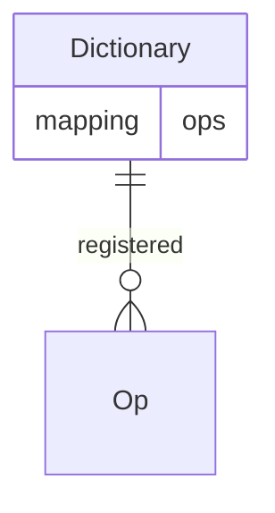

# UDS Standard Operation Library

A library for standard operation contracts used in UDS.

- ***Operations (Ops)***
    - are registered in the Dictionary.
    - are properly processed by ***Predicates***, ensuring the fulfillment of *Requires* and *Intents*.



## Contracts
- ### Operations
    ```
    ops
    ├ consensus
    │  ├ ProposeOp.sol
    │  └ VoteOp.sol
    └ initialize
        └ InitializeOp.sol
    ```

- ### Predicates
    ```
    predicates
    └ MsgSender.sol
    ```

- ### Utilities
    ```
    StorageLib.sol
    ```

## Contributing
Please check out the [Contributing Guide](./CONTRIBUTING.md).
