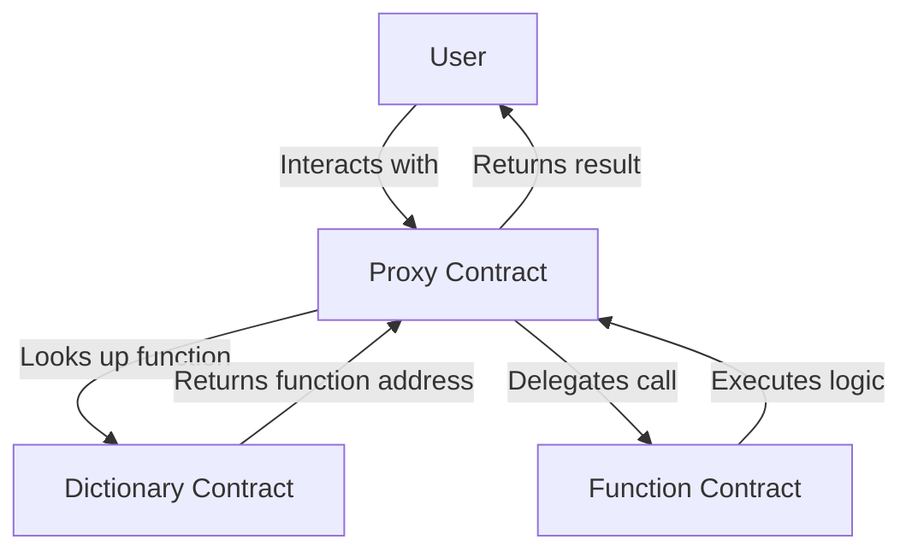

# Key Concepts and Architecture

Meta Contract implements the UCS (Upgradeable Clone for Scalable Contracts) architecture, providing a flexible and modular approach to smart contract development. This document outlines the key concepts of Meta Contract and provides an overview of its architecture, explaining how its components interact to create upgradeable and scalable smart contract systems.

## Core Components and Concepts

The Meta Contract architecture consists of three main components:

1. Proxy Contract
2. Dictionary Contract
3. Function Contracts

Let's explore each of these components, their roles in the system, and the key concepts they embody.

### 1. Proxy Contract

The Proxy Contract is the entry point for all interactions with a Meta Contract. It serves two primary purposes:

- **State Management**: The Proxy Contract stores and manages the state of the entire Meta Contract system.
- **Function Delegation**: It delegates function calls to the appropriate Function Contracts based on the function selector.

Key points:
- The Proxy Contract's address remains constant, even when upgrading functionality.
- It uses `delegatecall` to execute functions in other contracts while maintaining its own state.
- When a user interacts with the Meta Contract, they send their transaction to the Proxy Contract's address.

### 2. Dictionary Contract

The Dictionary Contract acts as a registry for all Function Contracts within a Meta Contract system. Its main responsibilities are:

- Mapping function selectors to the addresses of their corresponding Function Contracts.
- Providing a mechanism to update these mappings, enabling upgrades.

Key points:
- The Dictionary Contract can be upgraded to add new functions or change existing function mappings.
- It plays a crucial role in the upgradeability and modularity of Meta Contracts.
- When the Proxy Contract receives a call, it consults the Dictionary Contract to find the address of the appropriate Function Contract.

### 3. Function Contracts

Function Contracts contain the actual logic for individual functions or groups of related functions. They are the building blocks of a Meta Contract's functionality.

Key characteristics:
- Each Function Contract is independent and can be upgraded separately.
- They don't store state directly but instead work with the state stored in the Proxy Contract.
- Function Contracts can be shared across multiple Meta Contract instances, promoting code reuse.
- They are designed to be stateless, working with the state stored in the Proxy Contract.

## Architecture Overview

The following diagram illustrates how these components interact within the Meta Contract architecture:

## Key Features

### 1. Upgradeability

Upgradeability is a core feature of Meta Contracts, allowing for the evolution of contract functionality without changing the contract's address or losing its state.

How it works:
- To upgrade a function, deploy a new Function Contract and update the Dictionary Contract to point to the new address.
- The Proxy Contract will then delegate calls to the new Function Contract automatically.

Benefits:
- Bug fixes and feature improvements can be implemented without disrupting the entire system.
- Reduces the need for complex migration processes when updating contract logic.

### 2. Cloneability

Cloneability refers to the ability to create multiple instances of a Meta Contract system with minimal gas costs.

Key aspects:
- Multiple Proxy Contracts can be deployed, each with its own state.
- These Proxy Contracts can share the same Dictionary Contract and Function Contracts.
- This approach reduces deployment costs and allows for the creation of multiple instances of standardized contracts.

Use cases:
- Creating multiple instances of a standardized contract (e.g., token contracts, voting systems).
- Deploying personalized contract instances for users or organizations.

## Upgrade Process

The upgrade process in the Meta Contract architecture is straightforward:

1. Deploy a new Function Contract with updated logic.
2. Update the Dictionary Contract to point the relevant function selector(s) to the new Function Contract address.
3. The Proxy Contract will automatically use the new Function Contract for subsequent calls.

This process allows for granular upgrades without changing the Proxy Contract's address or disrupting the overall system.

## Security Considerations

While the Meta Contract architecture offers great flexibility, it's important to consider security aspects:

- Access controls should be implemented to restrict who can update the Dictionary Contract.
- Thorough testing and auditing of new Function Contracts is crucial before deployment.
- Monitoring and fail-safe mechanisms should be in place to detect and respond to potential issues.

## Conclusion

The Meta Contract architecture, based on the UCS model, provides a powerful and flexible approach to smart contract development. By separating concerns between state management, function mapping, and logic implementation, it enables upgradeable, modular, and scalable smart contract systems.

These key concepts and architectural components work together to create a flexible, upgradeable, and efficient smart contract system. As you progress through this documentation, you'll see how these concepts are applied in practice and how they contribute to the power and versatility of Meta Contracts.

For more detailed information on specific aspects of Meta Contracts, please refer to the following resources:

- [Meta Contract Deployment](../03-devops/01-deployment.md)
- [Upgrading Meta Contracts](../03-devops/03-upgrades.md)
