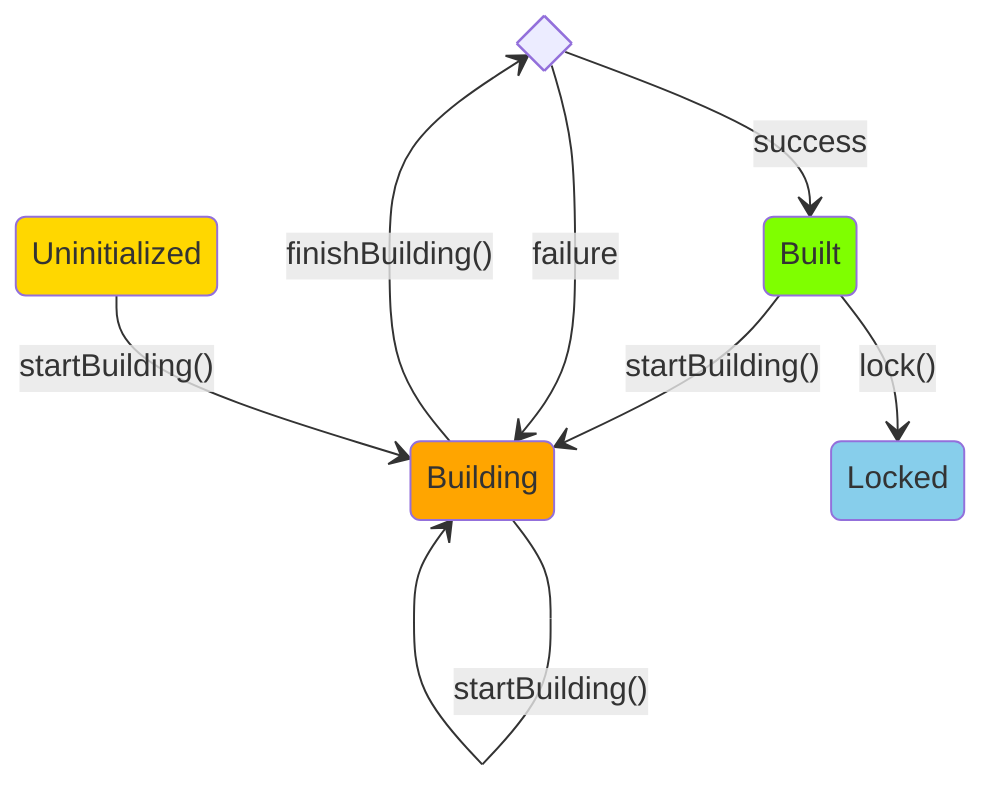

# Object Lifecycle
The object lifecycle represents the different states an object can go through during its existence. The lifecycle is managed by several methods that control the transitions between states and ensure the object's integrity. Here's a summary of the object lifecycle and the role of each method:

## Core Objects
- Function
- Bundle
- Proxy
- Dictionary

## States
- ***Uninitialized***: The initial state of an object when it is created but not yet initialized.
- ***Building***: The state where the object is being constructed, and its member variables are being set.
- ***Built***: The state where the object is fully constructed and ready for use.
- ***Locked***: The state where the object is locked and cannot be modified.

## Methods
1. `startBuilding()`
    - Transitions the object from the _Uninitialized_ or _Built_ state to the _Building_ state.
    - Called when the object's member variables need to be modified.
    - Allows the object to be modified even if it was previously in the _Built_ state.
2. `finishBuilding()`
    - Attempts to transition the object from the _Building_ state to the _Built_ state.
    - Called after the object's member variables have been modified.
    - Checks if all the member variables are in a valid state.
        - If successful, transitions the object to the _Built_ state.
        - If unsuccessful, outputs a warning and keeps the object in the _Building_ state.
3. `lock()`
    - Transitions the object from the _Built_ state to the _Locked_ state.
    - Prevents any further modifications to the object.

## Diagram

