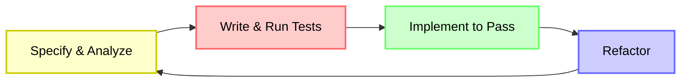

# Test-Driven Development

This guide outlines our approach to Test-Driven Development (TDD) and implementation in Meta Contract projects, leveraging Foundry as our testing framework and incorporating AI assistance throughout the process.

## Understanding Testing Challenges in Smart Contracts

Smart contract developers often face three major challenges:

1. **Managing Uncertainty**: The ever-evolving nature of technology and security threats makes it challenging to develop provably secure software.
2. **Managing Computational Resources**: Optimizing for gas efficiency (often called "gas golfing") can increase complexity and reduce readability.
3. **Managing Software Complexity**: Especially when dealing with complex domain logic, balancing functionality with simplicity becomes crucial.

To address these challenges, our AI-assisted Test-Driven Development (AITDD) approach, integrated with the architecture of Meta Contract, provides a robust framework through automated testing and modular design.

## AI-Assisted Test-Driven Development with Foundry

This section introduces an AI-assisted Test-Driven Development (TDD) approach using Foundry, enabling a more efficient and thorough development cycle.

### Basic TDD Workflow

1. **Specify & Analyze**: Define the feature or functionality you want to implement. Use AI to clarify project requirements and suggest test cases, identifying risks and challenges.
2. **Write Tests**: Create Foundry tests that define the expected behavior.
3. **Run Tests**: Execute the tests (they should fail initially).
4. **Implement**: Write the minimum code necessary to pass the tests.
5. **Refactor**: Improve the code while ensuring tests continue to pass.
6. **Repeat**: Move on to the next feature or refinement.



### Leveraging AI

1. **AI-Assisted Specification**: Utilize AI to articulate and refine project requirements and test cases.
2. **Continuous AI Feedback**: Leverage AI for code review and improvement suggestions, optimizing computational resources and enhancing security.
3. **Iterative Development**: Continuously refine tests and implementations based on AI insights, ensuring adaptability and robustness in the face of evolving challenges.

## Example Workflow

Here are practical ways to integrate AI into your TDD workflow.

### 1. Setting Up the Project

Create a new Meta Contract project. For details, refer to the [Setup Guide](../01-setup/index.md).

### 2. Defining Features and Analyzing Requirements

Clearly define the feature you want to implement, such as "allow users to vote on proposals" in a voting system. Gather requirements from stakeholders or documentation, and use AI to refine these requirements and suggest test cases. Identify any risks or challenges, like security concerns, and set success criteria for the feature's expected behavior and outcomes. This prepares you for writing tests in the next step.

### 3. Writing Unit Tests and Implementations

#### Colocation in Meta Contract Development

The architecture of Meta Contract allows for function-level granularity, enabling developers to manage functions in separate files. This feature facilitates a colocated TDD approach, where tests are placed in the same file as the implementation.

##### Benefits of Colocation

1. **Improved Maintainability**: Keep related code and tests together for easier updates.
2. **Enhanced Readability**: Developers can easily understand the expected behavior alongside the implementation.
3. **Faster Development Cycle**: Quickly iterate between writing tests and implementation.

#### Code Generation & Review with AI

1. **Test Case Generation with AI**

   Use AI to suggest potential test cases based on your function specifications.

   Example:
   ```
   Human: I'm writing a vote function for a voting system. What test cases should I consider?

   AI: For a vote function in a voting system, consider the following test cases:
   1. Successful vote cast
   2. Voting on a non-existent proposal
   3. Voting twice from the same address
   4. Voting after the proposal deadline
   5. Voting with insufficient voting power
   6. Correct event emission after voting
   7. Voting power accurately reflected in the vote count
   8. Boundary conditions (e.g., first vote, last vote)
   ```

2. **Code Review Assistance**

   After implementing a feature, use AI to review your code and suggest improvements.

   Example:
   ```
   Human: Can you review this vote function implementation?

   [Paste your implementation & tests here]

   AI: Here's a review of your vote function:
   1. Gas Optimization: Consider using uint256 instead of uint for better gas efficiency.
   2. Security: Add a check to ensure msg.sender has not voted before.
   3. Event Emission: Make sure to emit a VoteCast event for off-chain tracking.
   4. Error Handling: Use custom errors instead of require statements for better gas efficiency and more informative error messages.
   ```

#### Example of Colocated Test and Implementation

```solidity
// File: src/voting-system/functions/Vote.sol

// SPDX-License-Identifier: MIT
pragma solidity ^0.8.24;

import {Storage, Schema} from "bundle/voting-system/storages/Storage.sol";

contract Vote {
    // Implementation
    function vote(uint256 proposalId) public {
        Schema.Proposal storage $proposal = Storage.Proposals().getProposal(proposalId);

        // Check if the proposal exists
        if (!$proposal.exists()) revert VotingSystemErrors.ProposalNotFound();

        // Check if the voter has already voted
        if ($proposal.hasVoted(msg.sender)) revert VotingSystemErrors.AlreadyVoted();

        // Record the vote
        $proposal.setVote(msg.sender, true);

        // Emit event
        emit VoteCast(proposalId, msg.sender);
    }
}

// Unit Testing
import {MCTest} from "@mc-devkit/Flattened.sol";
import {VotingSystemErrors} from "bundle/voting-system/interfaces/VotingSystemErrors.sol";
import {VotingSystemEvents} from "bundle/voting-system/interfaces/VotingSystemEvents.sol";

contract VoteTest is MCTest {
    function setUp() public {
        address _vote = address(new Vote());
        _use(Vote.vote.selector, _vote);
    }

    function test_vote_success() public {
        // Setup: Create a proposal
        uint256 proposalId = 1;
        Storage.Proposals().createProposal(proposalId, Schema.Proposal({exists: true, ...}));

        // Test: Expect VoteCast event
        vm.expectEmit();
        emit VoteCast(proposalId, address(this));

        // Action: Cast a vote
        Vote(target).vote(proposalId);

        // Assert: Check that the vote was recorded
        assertTrue(Storage.Proposals().getProposal(proposalId).hasVoted(address(this)));
    }

    function test_vote_alreadyVoted() public {
        // Setup: Create a proposal and record a vote
        uint256 proposalId = 1;
        Storage.Proposals().createProposal(proposalId, Schema.Proposal({exists: true, ...}));
        Storage.Proposals().setVote(proposalId, address(this), true);

        // Test: Expect revert
        vm.expectRevert(VotingSystemErrors.AlreadyVoted.selector);

        // Action: Attempt to vote again
        Vote(target).vote(proposalId);
    }
}
```

Then, run tests:
```bash
forge test -mc VoteTest
```

This example demonstrates:
- The implementation of the `vote` function
- Two unit tests: one for successful voting and one for the "already voted" scenario
- Use of Meta Contract's storage patterns
- Event emission and checking
- Error handling and testing

### 4. Writing Integration Tests

Integration tests are crucial for ensuring that different components of your system work together correctly. They differ from unit tests in that they test the interaction between multiple functions or contracts.

1. Create a test file (e.g., `test/VotingSystem.t.sol`):

   ```solidity
    // SPDX-License-Identifier: MIT
    pragma solidity ^0.8.24;

    import {MCTest} from "@mc-devkit/Flattened.sol";
    import {IVotingSystem} from "bundle/voting-system/interfaces/IVotingSystem.sol";
    import {VotingSystemErrors} from "bundle/voting-system/interfaces/VotingSystemErrors.sol";
    import {VotingSystemEvents} from "bundle/voting-system/interfaces/VotingSystemEvents.sol";

    contract VotingSystemTest is Test {
        IVotingSystem public votingSystem = IVotingSystem(target);

        function setUp() public {
            address _vote = address(new Vote());
            _use(Vote.vote.selector, _vote);
            address _tally = address(new Tally());
            _use(Tally.tally.selector, _tally);
        }

        function test_scenario_votingWithTie() public {
            // Setup: Create a proposal
            uint256 proposalId = votingSystem.createProposal("Test Proposal");

            // Action: Two users vote on the proposal
            vm.prank(address(0x1));
            votingSystem.vote(proposalId, true);
            vm.prank(address(0x2));
            votingSystem.vote(proposalId, false);

            // Test: Expect TalliedWithTie event
            vm.expectEmit();
            emit VotingSystemEvents.TalliedWithTie(proposalId);

            // Action & Assert: Tally votes and check for tie
            votingSystem.tally(proposalId);
        }
    }
   ```

2. Run tests:
   ```bash
   forge test
   ```

3. Get test coverage:
   ```bash
   forge coverage
   ```

This integration test demonstrates:
- Setting up multiple functions (`vote` and `tally`)
- Testing a complete voting scenario
- Checking interactions between different parts of the system

### 5. Refactoring and Iteration

Refactoring is essential in TDD to improve code structure without changing its behavior. Focus on simplifying code, removing redundancies, and enhancing readability. Break down large functions into smaller, reusable components, and ensure variable and function names are descriptive. Apply the DRY principle to eliminate duplicate code and optimize performance, especially for gas efficiency in smart contracts. Always update documentation to reflect changes. For example, refactor a vote calculation by creating a [helper function](./04-using-internal-library.md) to sum votes, promoting clarity and reuse.

## Best Practices

1. **Comprehensive Testing**: Aim for high test coverage, including edge cases and failure scenarios.
2. **Gas Optimization**: Use Foundry's gas reporting feature to optimize contracts while maintaining readability.
3. **Regular AI Code Review**: Periodically review code with AI assistance to catch potential issues early.
4. **Security-First Approach**: Utilize Foundry's built-in security analysis tools and consider additional audits for critical contracts.
5. **Documentation Consistency**: Keep documentation up-to-date with code changes, including inline comments explaining complex logic.
6. **Community Involvement**: Engage with the Meta Contract community to share testing strategies and stay updated on best practices.
7. **Leverage Function-Level Granularity**: Take advantage of Meta Contract's architecture to write focused, granular tests for each function.
8. **Use Meta Contract DevKit**: Utilize the tools provided in the Meta Contract DevKit for more efficient testing and development.
9. **Consistent Naming Conventions**: Follow Meta Contract's naming conventions for functions, events, and errors to maintain consistency across your project.

By following this AI-assisted TDD approach with Foundry and leveraging the architecture of Meta Contract for colocation, you can develop more robust, efficient, and well-tested smart contract projects.

## Troubleshooting Common Issues

1. **"Function selector not found" error**:
   - Ensure that you've correctly used the `_use` function in your test setup to map function selectors to their implementations.

2. **Gas estimation failed**:
   - Check for infinite loops or extremely gas-intensive operations in your code.
   - Ensure you're not accidentally calling non-existent functions.

3. **Storage conflicts**:
   - Verify that you're using the correct storage slots and following Meta Contract's storage patterns.

4. **Event emission tests failing**:
   - Double-check the event signature and parameters.
   - Ensure you're using `vm.expectEmit` correctly, matching the number of indexed parameters.

5. **Unexpected reverts in tests**:
   - Check that all necessary setup steps (e.g., creating a proposal before voting) are performed in your tests.
   - Verify that you're calling functions with the correct parameters and from the correct addresses (use `vm.prank` when necessary).

If you encounter persistent issues, don't hesitate to reach out to the [Meta Contract community](https://github.com/metacontract/mc/discussions) for support.
