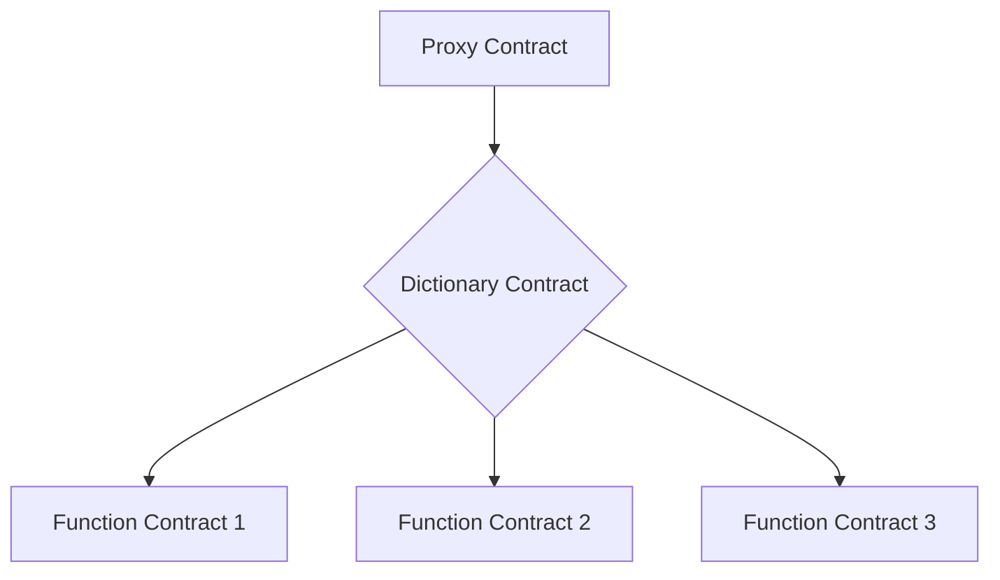

# Documentation Guidelines

This guide outlines the standards and best practices for creating and maintaining documentation in the Meta Contract project.

## General Principles

1. Write clear, concise, and accurate documentation.
2. Keep documentation up-to-date with code changes.
3. Use a consistent style and format across all documentation.
4. Write for your audience, considering their technical background.

## File Naming Convention

Use kebab-case for all documentation file names:

```
what-is-meta-contract.md
key-concepts.md
```

## Markdown Formatting

1. Use ATX-style headers (`#` for h1, `##` for h2, etc.).
2. Use backticks for inline code and triple backticks for code blocks.
3. Use appropriate language identifiers for code blocks (e.g., ```solidity).
4. Use unordered lists (`-`) for most lists, and ordered lists (`1.`) when sequence matters.

## Documentation Header

Each documentation file should start with a metadata block followed by the document content:

```markdown
---
keywords: [keyword1, keyword2, keyword3]
tags: [tag1, tag2, tag3]
last_update:
  date: YYYY-MM-DD
  author: [Author Names]
---

# Document Title

Brief description or introduction to the document content.

[Main document content starts here]
```

See details in [Docusaurus Frontmatter](https://docusaurus.io/docs/create-doc#doc-front-matter). Ensure to add any necessary elements according to the Docusaurus frontmatter guidelines.

## Code Documentation

### Solidity

Use [NatSpec](https://docs.soliditylang.org/en/latest/natspec-format.html) comments for all public and external functions:

```solidity
/**
 * @notice Calculates the sum of two numbers
 * @param a The first number
 * @param b The second number
 * @return The sum of a and b
 */
function calculateSum(uint256 a, uint256 b) public pure returns (uint256) {
    return a + b;
}
```

## Diagrams

Use [Mermaid](https://mermaid.js.org/intro/syntax-reference.html) for creating diagrams in documentation. Include the diagram source in the Markdown file:


