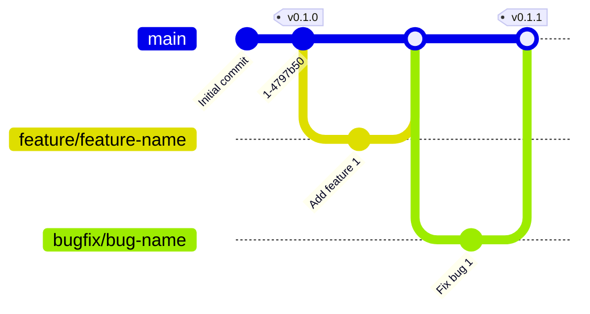

# Branching and Release Strategy

This guide outlines the branching and release management practices for the Meta Contract project using [GitHub Flow](https://docs.github.com/get-started/quickstart/github-flow) and [Semantic Versioning](https://semver.org/).

## Basics of GitHub Flow

- **main**: Always maintain a stable state.
- **feature branches**: Short-lived branches for new features or fixes. Created from `main` and merged back into `main` once work is complete.

## Branch Naming Conventions

- **Prefix**: Use an appropriate prefix to indicate the purpose of the branch.
- **Lowercase and Hyphens**: Use lowercase letters for branch names and separate words with hyphens.

### Examples:
  - `feature/user-authentication`
  - `bugfix/fix-login-error`

## Semantic Versioning (SemVer)

Semantic Versioning follows the format `MAJOR.MINOR.PATCH`, where:

- **MAJOR**: Incremented for incompatible API changes.
- **MINOR**: Incremented for adding functionality in a backwards-compatible manner.
- **PATCH**: Incremented for backwards-compatible bug fixes.

## Versioning Workflow

1. **New Feature Addition**:
   - Increment the MINOR version.
   - Example: From `v1.0.0` to `v1.1.0`.

2. **Bug Fix**:
   - Increment the PATCH version.
   - Example: From `v1.1.0` to `v1.1.1`.

3. **Incompatible Changes**:
   - Increment the MAJOR version and reset MINOR and PATCH to zero.
   - Example: From `v1.1.1` to `v2.0.0`.

4. **Hotfix**:
   - Increment the PATCH version for urgent fixes.
   - Example: From `v2.0.0` to `v2.0.1`.

## Release Process

### Stable Releases

1. Create a feature branch from `main` for new releases.
2. Once the release is ready, merge it back into `main` and tag with the new version number.

### Hotfix Releases

1. Create a hotfix branch from `main` for urgent fixes.
2. Once the hotfix is ready, merge it back into `main` and tag with the new version number.

## Example Workflow

## Conclusion

By adopting GitHub Flow and Semantic Versioning, we maintain a clear and consistent development and release process, facilitating easier understanding of project state and changes over time. For more details, refer to [GitHub Flow](https://docs.github.com/en/get-started/quickstart/github-flow).
