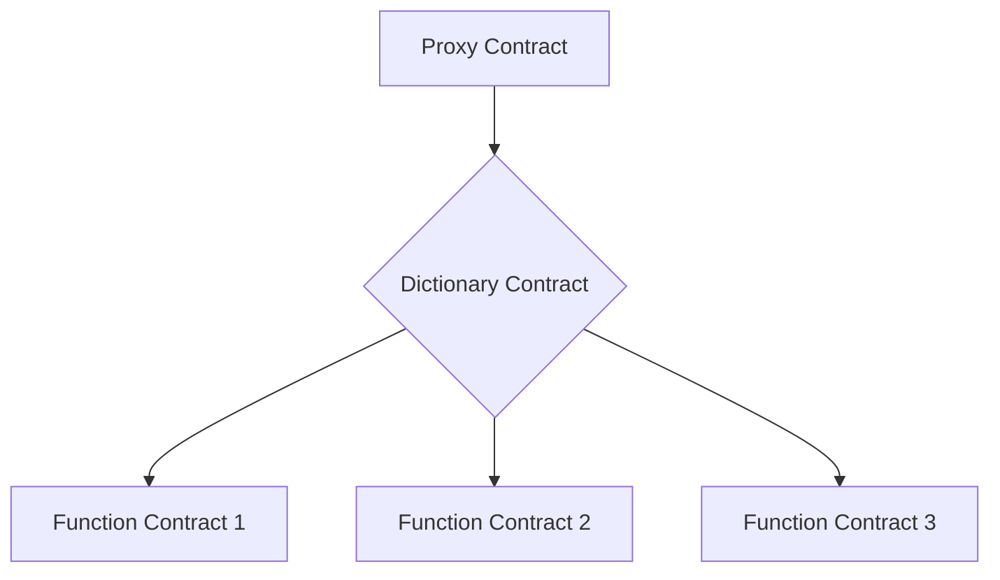

# Documentation Guidelines

This guide outlines the standards and best practices for creating and maintaining documentation in the Meta Contract project.

## General Principles

1. Write clear, concise, and accurate documentation.
2. Keep documentation up-to-date with code changes.
3. Use a consistent style and format across all documentation.
4. Write for your audience, considering their technical background.

## File Naming Convention

Use kebab-case for all documentation file names:

```
what-is-meta-contract.md
key-concepts.md
```

## Markdown Formatting

1. Use ATX-style headers (`#` for h1, `##` for h2, etc.).
2. Use backticks for inline code and triple backticks for code blocks.
3. Use appropriate language identifiers for code blocks (e.g., ```solidity).
4. Use unordered lists (`-`) for most lists, and ordered lists (`1.`) when sequence matters.

## Documentation Header

Each documentation file should start with a metadata block followed by the document content:

```markdown
---
title: "Full Document Title"
version: 0.1.0
lastUpdated: YYYY-MM-DD
author: [Author Names]
scope: [Scope of the document, e.g., dev, arch]
type: [Type of document, e.g., spec, guide]
tags: [tag1, tag2, tag3]
relatedDocs: ["RELATED_DOC_1.md", "RELATED_DOC_2.md"]
changeLog:
  - version: 0.1.0
    date: YYYY-MM-DD
    description: [Description of initial version]
---

# Document Title

Brief description or introduction to the document content.

[Main document content starts here]
```

## Code Documentation

### Solidity

Use NatSpec comments for all public and external functions:

```solidity
/**
 * @notice Calculates the sum of two numbers
 * @param a The first number
 * @param b The second number
 * @return The sum of a and b
 */
function calculateSum(uint256 a, uint256 b) public pure returns (uint256) {
    return a + b;
}
```

## Diagrams

Use Mermaid for creating diagrams in documentation. Include the diagram source in the Markdown file:



## Versioning Documentation

1. Start all document versions at 0.1.0.
2. Increment the version number when making significant updates to a document.
3. Clearly indicate which version of the software each document applies to.

## Review Process

1. All documentation changes should go through peer review.
2. Check for technical accuracy, clarity, and adherence to these guidelines.
3. Ensure all links are working and point to the correct destinations.

By following these guidelines, we ensure consistency and quality across all Meta Contract documentation, making it easier for developers and users to understand and use our project.
