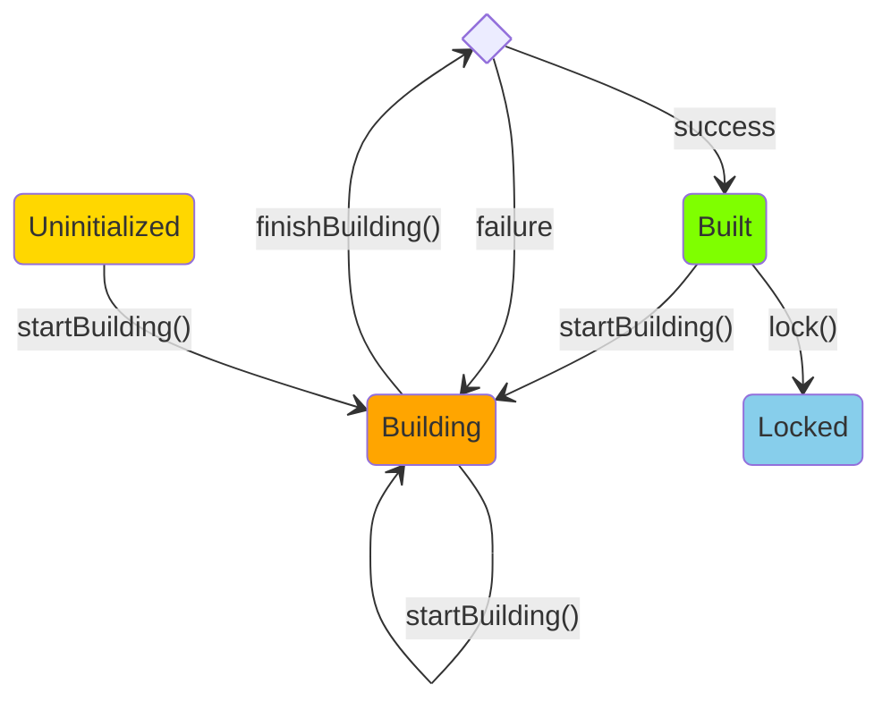

# Usage

This guide provides an overview of key functions and modifiers in the Meta Contract DevKit, focusing on their usage in scripting and testing scenarios.

## Scripting

When writing deployment or interaction scripts, you'll typically use the `MCScript` base contract. Here's a key modifier you'll often use:

### startBroadcastWithDeployerPrivKey

This modifier is used in scripting to broadcast transactions using the deployer's private key.

```solidity
modifier startBroadcastWithDeployerPrivKey();
```

**Example:**
```solidity
function run() public startBroadcastWithDeployerPrivKey {
    // Deployment script logic here
}
```

## Testing

For writing tests, you'll use the `MCTest` base contract. Here are some key functions and modifiers:

### startPrankWithDeployer

This modifier is used in testing to simulate transactions or function calls from the deployer's address.

```solidity
modifier startPrankWithDeployer();
```

**Example:**
```solidity
function setUp() public startPrankWithDeployer {
    // Test setup logic here
}
```

### setDictionary

This function allows manual setting or updating of the dictionary contract address for a target contract in tests.

```solidity
function setDictionary(address target, address dictionary) internal;
```

**Example:**
```solidity
setDictionary(proxy, dictionary);
```

### ignorePrecompiles

This function excludes precompiled contracts from consideration in certain test cases.

```solidity
function ignorePrecompiles(address target) internal;
```

**Example:**
```solidity
ignorePrecompiles(dictionary);
```

## Object Lifecycle Management

The DevKit provides a robust system for managing the lifecycle of core Meta Contract objects (Function, Bundle, Proxy, Dictionary). This system uses state transitions to ensure the integrity and proper usage of these objects.

### Core Objects
- Function
- Bundle
- Proxy
- Dictionary

### States
- ***Uninitialized***: The initial state of an object when it is created but not yet initialized.
- ***Building***: The state where the object is being constructed, and its member variables are being set.
- ***Built***: The state where the object is fully constructed and ready for use.
- ***Locked***: The state where the object is locked and cannot be modified.

### Methods
Key methods for lifecycle management include:

1. `startBuilding()`
    - Transitions the object from the _Uninitialized_ or _Built_ state to the _Building_ state.
    - Called when the object's member variables need to be modified.
    - Allows the object to be modified even if it was previously in the _Built_ state.
2. `finishBuilding()`
    - Attempts to transition the object from the _Building_ state to the _Built_ state.
    - Called after the object's member variables have been modified.
    - Checks if all the member variables are in a valid state.
        - If successful, transitions the object to the _Built_ state.
        - If unsuccessful, outputs a warning and keeps the object in the _Building_ state.
3. `lock()`
    - Transitions the object from the _Built_ state to the _Locked_ state.
    - Prevents any further modifications to the object.

### Diagram


## Best Practices

1. Always use the appropriate base contract (`MCScript` for scripting, `MCTest` for testing) to ensure access to all relevant DevKit features.
2. Leverage the object lifecycle management system to maintain the integrity of your Meta Contract objects throughout their usage.
3. Use the provided modifiers and functions to simulate different scenarios in your tests, ensuring comprehensive coverage of your contract's behavior.

For more advanced usage patterns and detailed API documentation, refer to the [API Reference](./03-api-reference/index.md) section.
